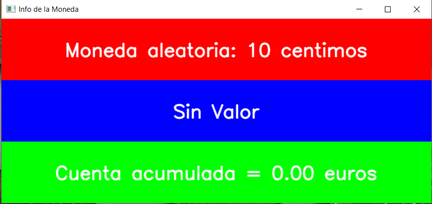

# Cuaderno 3 

Este Cuaderno muestra el desarrollo del tercer cuaderno de la asignatura, el cual incluye 2 ejercicios.

### Pasos Previos

Antes de si quieras empezar hay que seccionarte de tener disponible 1 apartado fundamental:

* Un entorno virtual creado con Python, opencv-python y matplotlib instalado (En este cuaderno se utilizará Anaconda)

### Desarrollo

Para empezar dentro de nuestro cuadernos tendremos unas librerías instaladas:

```python
import cv2  
import numpy as np
import matplotlib.pyplot as plt
import random
import seaborn as sns
from sklearn.metrics import confusion_matrix, accuracy_score, precision_score, recall_score, f1_score
```
 
* **OpenCV (cv2)**: Se utiliza para la captura y procesamiento de imágenes y video en tiempo real. En el cuaderno se usará para capturar videos de la cámara web y añadir figuras sobre fotogramas. Es la librería principal de tratamiento de Fotogramas

* **NumPy (np)**: Proporciona estructuras de datos eficientes. En el cuaderno se usa para manipular datos de las imágenes y es una opción para crear un collage.

* **Matplotlib (plt)**: Se usa para la visualización de imágenes en gráficos y ventanas. Lo utilizaremos para enseñar imágenes procesadas, aunque no es indispensable para los ejercicios que incluyan la cámara en tiempo real.

* **random**: Se utiliza para generar números y elecciones aleatorias. En este proyecto, se emplea para realizar simulaciones y seleccionar transformaciones aleatorias sobre las imágenes (rotación, traslación, etc.).

* **Seaborn(sns)**: Es una biblioteca para la visualización de datos basada en Matplotlib, que proporciona gráficos estadísticos más atractivos. Se utiliza para generar la matriz de confusión como un gráfico de calor (heatmap).

* **Scikit-learn(sklearn.metrics)**: Es una librería de machine learning que incluye herramientas para la evaluación de modelos. En este proyecto, se usa para calcular la matriz de confusión y las métricas de rendimiento (precisión, recall, F1-score y exactitud) para evaluar los resultados de las clasificaciones y simulaciones.

Una vez están esas librerías instaladas, se puede empezar por las propias tareas

### Tarea 1 - Detección de unas monedas

El primer ejercicio se basa en el uso de propiedades geometricas para poder analizar monedas reales. Para la realización de este ejercicio se necesita de 4 apartados los cuales cada uno tienen varias funciones.

### 1.- Valores y llamadas

Lo primero es entender las llamadas que se realizarán más los valores de los que se disponen.

```python
cuenta_acumulada = 0
pixel_A_MM = 0

monedas = {
    '1 centimo': 8.13,
    '2 centimos': 9.38,
    '5 centimos': 10.63,
    '10 centimos': 9.88,
    '20 centimos': 11.13,
    '50 centimos': 12.13,
    '1 euro': 11.63,
    '2 euros': 12.88
}

valores_monedas = {
    'Sin Valor': 0.00,
    '1 centimo': 0.01,
    '2 centimos': 0.02,
    '5 centimos': 0.05,
    '10 centimos': 0.10,
    '20 centimos': 0.20,
    '50 centimos': 0.50,
    '1 euro': 1.00,
    '2 euros': 2.00
}

moneda_actual = '10 centimos'
imagen_original = cv2.imread('Monedas/Monedas2.jpeg')

procesar_imagen(imagen_original, monedas, valores_monedas)
cv2.waitKey(0)
cv2.destroyAllWindows()
```

Se tendrá los valores de las monedas a nivel monetario y el radio de cada moneda, utilizado para tratar con las propios calculos de las monedas.

"cuenta_acumulada" que cuenta la acumulación de dinero a través de pulsar varias veces en distintas monedas y pixel_A_MM que se encarga de guardar el valor de proporción de pixeal a milimetro de la primera instancia, más explicado después

Por ultimo, están el cargado de la imagen_original la llamada a la primera función y nada más

### 2.- Procesar los eventos en la imagen 

Para este apartado se disponen de dos funciones. "procesar_imagen" y "Hough()" explicando primero la de Hough, es simplemente todo el proceso necesario para aplicar Hough sobre la imagen, 

        El Filtro o Transformada de Hough es una técnica utilizada para detectar formas geométricas específicas, como líneas, círculos o elipses, dentro de una imagen. Es especialmente útil cuando las formas están parcialmente ocultas, dañadas o con ruido.

        La forma de trabajar es aplicar Hough seleccionando especificamente circulos y luego aplicar una máscara sobre la imagen original, dependiendo de los valores puestas a la función algunas veces pueden quedar imperfecciones.

Siguiendo con la función "procesar_imagen()", está se encarga de tomar la imagen, pasarsela a Hough y luego aplicar umbralizado para poder sacar los contornos de las monedas (cosa que se hace mucho más simple con Hough), una vez se tienen los contornos se hacen tres calculos

1. Calcular el aréa y comprobar si es mayor que un umbral esto elimina posible contornos erroneos generados por cv2.findContours

2. Una vez que se tienen los contornos importantes, se calcula el pixel donde esta centro de cada contorno

3. Dicho centro se utiliza para añadir en la imagen original hitbox y que al pulsar dentro de ese aréa detecte el contorno y haga algo que se verá más adelante

### 3.- Generar monedas aleatorias y tratar las monedas

Este apartado cuenta con 2 apartados pequeños "generar_nueva_moneda()" y "moneda_aleatoria()" y un apartado grande, "sacar_monedas(radius)".

Los apartados pequeños son relativamente sencillos y bastante intuitivos, "moneda_aleatoria()" genera una nombre de moneda aleatoria cada vez que se le llama y "generar_nueva_moneda()" llama a la función anterior para cambiar el valor. La necesidad de esto es para el procesado de la imagen así que se explicará en ese apartado con calma

El apartado grande "sacar_monedas(radius)" se basa en sacar que moneda se le esta pasado, necesitando solamente del radio. Para ello primero se debe haber establecido una proporción pixeles a mm, de la imagen para ello se necesita 3 datos que es el nombre de una moneda, su radio en pixeles en la imagen y el radio en la vida real, tras ello se divide el radio en pixeles entre el radio real y luego se compará con los valores reales de las monedas, se tiene un nivel de tolerancía permitido por si acaso ocurrá algo y moneda detectada.

Hay algo que puede no tener sentido: ¿a qué se refiere con el nombre? Esto significa que se necesita una primera moneda de referencia para poder detectar el resto. En otras palabras, en lugar de simplemente tomar una imagen y seleccionar cualquier moneda directamente, es necesario proporcionar una muestra inicial que sirva como base para futuras detecciones.

```python
    if pixel_A_MM == 0:
        radio_mm = radius_in_pixels / monedas[moneda_actual]
        pixel_A_MM = radio_mm
    else:
        radio_mm = radius_in_pixels / pixel_A_MM
```

### 4.- Procesar la imagen

Este es el apartado más extenso, aunque consta de solo dos secciones. La idea es sencilla: la imagen que se ha pasado al código, que contiene las hitboxes, se muestra en pantalla. Pero, ¿qué ocurre al pulsar una hitbox? Es aquí donde entra en juego otra pestaña que tiene tres secciones diferentes, cada una con un color distinto. A continuación, se explicará cada una en orden descendente.

<div align="center">
    
</div>

<div align="center"> Ventana extra </div>

1. Sección Roja (Moneda Aleatoria):

* Función: En esta sección se muestra una moneda seleccionada de forma aleatoria.

* Descripción: El texto indica el valor de la moneda seleccionada en ese momento, por ejemplo, "10 céntimos". Esta moneda aleatoria se genera cada vez que se interactúa con las hitboxes de las monedas en la imagen principal.

* Interacción: El usuario puede ver cuál es la moneda aleatoria actual. Este valor cambiará cuando se pulse una nueva hitbox.

Cabe destacar como información importante que aquí es donde se utilizan dos funciones pequeñas mencionadas anteriormente: generar_nueva_moneda() y moneda_aleatoria(). La importancia de estas funciones radica en que, antes de realizar cualquier cálculo, primero deben seleccionar y generar una moneda. Este valor será el que se usará para calcular el promedio de los píxeles de la imagen correspondiente. Es crucial que la primera moneda seleccionada sea correcta, ya que los cálculos y las selecciones posteriores dependen de este valor inicial.

2. Sección Azul (Valor de la Moneda):

* Función: Esta sección muestra información sobre el valor de la moneda seleccionada en la imagen de referencia. Si no hay una moneda seleccionada o no se ha interactuado aún, el mensaje por defecto es "Sin Valor".

* Descripción: Dependiendo de la interacción del usuario con la imagen de las monedas, esta sección se actualizará para mostrar el valor de la moneda tocada o seleccionada. Si la moneda seleccionada no coincide con ninguna moneda válida, seguirá mostrando "Sin Valor".

* Interacción: El usuario puede pulsar sobre las monedas para actualizar esta sección con el valor correspondiente, facilitando la comparación con la moneda aleatoria.

3. Sección Verde (Cuenta Acumulada):

* Función: Esta sección muestra la cantidad acumulada de dinero, sumando los valores de las monedas seleccionadas por el usuario.

* Descripción: Inicialmente, la cuenta acumulada es de "0.00 euros". A medida que el usuario selecciona monedas en la interfaz, el valor acumulado se actualizará. Por ejemplo, si el usuario selecciona una moneda de 10 céntimos, el contador sumará ese valor.

* Interacción: A medida que se interactúa con las hitboxes de las monedas y se seleccionan diferentes monedas, esta cuenta irá sumando el valor de cada moneda seleccionada, proporcionando al usuario una visión clara de la cantidad total acumulada.

#### Preparación 

Para el segundo ejercicio por mera comodida es mejor poner arriba del todo las entradas de las imagenes a utilizar ya que si no luego se va a repetir algo de codigo poniendolo abajo. 

### Tarea 2 - Detección distintos microplasticos

Este proyecto tiene como objetivo clasificar imágenes en tres categorías diferentes: Pellet, Fragmento, y Alquitrán. El sistema utiliza características geométricas y de color para identificar la clase de la imagen. Una vez identificada la clase de la imagen, se realiza una simulación que distribuye resultados aleatorios ponderados por los porcentajes de clasificación.

Además, se aplican diferentes tipos de transformaciones (rotación, traslación, ruido, ajuste de brillo) para evaluar cómo la imagen modificada afecta la clasificación.

Finalmente, el sistema genera una matriz de confusión para evaluar la precisión de las predicciones y calcular métricas de rendimiento como exactitud o  precisión.

Para simplificar el ejercicio, se dividirá en dos grandes apartados. El primero se centrará en los cálculos necesarios para identificar cada imagen, utilizando porcentajes para determinar a qué clase pertenece. El segundo apartado se enfocará en cómo usar esos valores para generar una matriz de confusión que represente los datos obtenidos a partir de muestras generadas tras procesar esas mismas imágenes

### Calculo de porcentajes 

Para calcular los porcentajes de cada categoría, es necesario definir diferentes propiedades en las que el programa pueda basarse para generar un porcentaje que indique qué tan probable es que un contorno pertenezca a esa etiqueta. Para esto, se han utilizado técnicas muy distintas entre los diferentes tipos de microplásticos. A continuación, se explicará el proceso por secciones para mayor simplicidad.

1. Cálculo de Porcentaje para Fragmentos

Para los fragmentos se necesita evaluar los "bordes" de los contornos presentes en la imagen y determinar si estos corresponden a fragmentos basados en las siguientes características geométricas:

* Angularidad: Número de vértices en el contorno.

* Relación Ancho-Alto: Relación de rectangularidad.

* Compacidad: Calculada como el área dividida por el perímetro al cuadrado.

* Variabilidad de Distancias: Distancias desde el centroide hasta el contorno.

        Cada valor proporciona una métrica sobre la estructura del contorno

        - La angularidad mide qué tan compleja es la forma, 
        
        - La relación ancho-alto determina si el contorno es más rectangular o elíptico 
        
        - La compacidad ayuda a identificar formas más compactas como círculos 
        
        - La variabilidad de distancias refleja la irregularidad del contorno, útil para detectar fragmentos o formas menos uniformes

Una vez que se calculan estos valores, se ajustan a ciertos umbrales. Si el contorno están dentro de los umbrales, se considera un fragmento. 

La función calcular_probabilidad_fragmentos() determina el porcentaje de contornos que cumplen con estas condiciones.

2. Cálculo de Porcentaje para Pellets

El cálculo para los pellets también se basa en características geométricas aunque esta véz en la circularidad del contorno. Se examinan las siguientes características:

* Circularidad: Relación entre el área y el perímetro, para verificar si el contorno es circular.

* Relación de Ejes: Para contornos elípticos, se evalúa la proporción entre los ejes mayor y menor.

La función obtener_valores_geometricos_pellet() evalúa los contornos, descartando aquellos con área o perímetro muy pequeños, y luego aplica estas verificaciones geométricas. 

A continuación, se utilizan dos pruebas basadas en estos valores, las cuales deben estar dentro de un umbral determinado. A medida que se superan estas pruebas, se va acumulando un valor que se incrementa poco a poco. Este valor acumulado luego se divide por el número total de contornos multiplicado por 2, ya que cada contorno pasa por dos pruebas. Esto representa el número total de tests realizados.

3. Cálculo de Porcentaje para Alquitrán

El reconocimiento de alquitrán se realiza mediante un análisis de color. La función determinar_color_dominante() evalúa los colores promedio de los contornos en la imagen y determina si son predominantemente negros. 

Si el color dominante está lo suficientemente cerca del negro, se considera que la imagen contiene alquitrán. 

Se calcula un porcentaje de certeza basado en la distancia de color entre el negro puro y los colores de la imagen.

4. Tratado de Datos y Normalización

Una vez obtenidos los porcentajes de fragmentos, pellets y alquitrán, se utiliza la función normalizar_porcentajes() que se encarga de ajustar correctamente estos porcentajes, asegurando que la suma total sea siempre 100%. 

        La necesidad de normalizar radica en que los porcentajes obtenidos en cada apartado indican únicamente si la imagen corresponde o no a esa categoría. El proceso de normalización convierte estos tres porcentajes independientes en un único conjunto equilibrado que refleja la proporción relativa de cada clase.

Finalmente, dependiendo del mayor valor de certeza, se asigna la clasificación final a la imagen. Esta clasificación final se puede usar como resultado o para generar simulaciones o matrices de confusión en análisis posteriores, que será el ultimo apartado.

### Calculo de simulaciones, tranformaciones y matrices de confusión

El objetivo de este ultimo apartado es entender como hacer una simulación, la necesidad de hacer transformaciones y como con ello generar una matriz de confusión.

### 1. ¿Qué es y cómo funciona una simulación?

Una simulación se refiere en el caso de este apartado, al proceso de realizar múltiples pruebas para determinar la clasificación de una imagen (Pellet, Alquitrán o Fragmento).

La función simular_pruebas() realiza simulaciones basadas en los porcentajes de cada clase que se han calculado previamente. Los porcentajes representan la certeza de que la imagen pertenece a cada clase.

Para ello se generan 100 pruebas aleatorias en las que cada clase tiene un peso correspondiente a su porcentaje. A medida que se ejecutan las pruebas, se acumulan los resultados en un diccionario.

Esto devuelve el número de veces que cada clase fue seleccionada, lo que ayuda a evaluar cómo de probable es que la imagen pertenezca a una categoría en particular.

```python
Resultados de la simulación:
----------------------------
Pellet: 15 veces (15.00%)
Alquitrán: 29 veces (29.00%)
Fragmento: 56 veces (56.00%)
```

Por ejemplo, si el porcentaje de fragemento es del 58%, el sistema seleccionará pellets aproximadamente el 58% de las veces durante las pruebas.

### 2. ¿Cómo se hacen las transformaciones y para qué se usan?

Para evaluar la robustez del sistema de clasificación, se aplican diversas transformaciones a las imágenes originales. Estas modificaciones crean versiones alteradas de la imagen para simular condiciones realistas en las que la imagen puede verse afectada. Las transformaciones disponibles son:

* Rotación (aplicar_rotacion): La imagen se rota en un ángulo aleatorio entre -45 y 45 grados. 

* Traslación (aplicar_traslacion): Se desplaza la imagen en las direcciones X e Y en un rango de -30 a 30 píxeles. 

* Ruido (aplicar_ruido): Se añade ruido gaussiano a la imagen, lo que simula condiciones de imagen con ruido. 

* Brillo (ajustar_brillo): Se ajusta el brillo de la imagen añadiendo o restando un valor aleatorio. 

Estas transformaciones se utilizan para crear versiones modificadas de la imagen, que luego son evaluadas por el sistema para comprobar su capacidad de clasificar correctamente las imágenes bajo diferentes condiciones.

En palabras más simples se utiliza estás nuevas imagenes para sacar los porcentajes que luego ser´qn lo que se pongan en la matriz

### 3. ¿Qué es una matriz de confusión y cómo se genera?

La matriz de confusión es una herramienta que evalúa la precisión de un modelo de clasificación comparando las predicciones realizadas con las clases reales. Viendolo nuevamente por secciones

1. Generación: 

    La función generar_matriz_confusion() toma las imágenes originales y las somete a diferentes transformaciones (rotación, traslación, ruido, brillo). Para cada imagen modificada, se realiza una simulación basada en los porcentajes calculados 20 veces.

    Las clasificaciones predichas (basadas en la simulación) se comparan con la clase real de la imagen (Pellet, Alquitrán, Fragmento), y ambos se almacenan.

2. Visualización: 

    La función mostrar_matriz_confusion() utiliza estos datos para generar y mostrar la matriz de confusión. Esta matriz tiene filas que representan las clases reales y columnas que representan las predicciones. El valor en cada celda muestra cuántas veces se predijo una clase en particular cuando la clase real era otra.

3. Cálculo de métricas: 

    Además de la matriz de confusión, se calculan varias métricas de rendimiento, para verificar que todo este funcionando a su maximo pontencial

        - Exactitud (Accuracy): Proporción de predicciones correctas sobre el total.
        
        - Precisión (Precision): Qué porcentaje de las predicciones positivas fue correcto.
        
        - Recall: Qué porcentaje de casos reales positivos fueron predichos correctamente.
        
        - F1-Score: La media armónica entre precisión y recall.
        
    La matriz de confusión y estas métricas proporcionan una visión clara del rendimiento del modelo y su capacidad para clasificar correctamente las imágenes, incluso después de haber sido modificadas.

<div align="center">
    
</div>

<div align="center"> Ejemplo de resultado de matriz de confusión </div>
